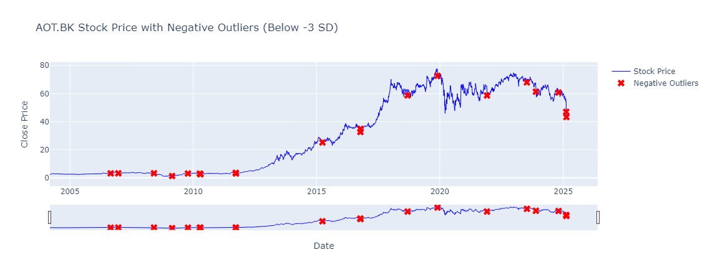
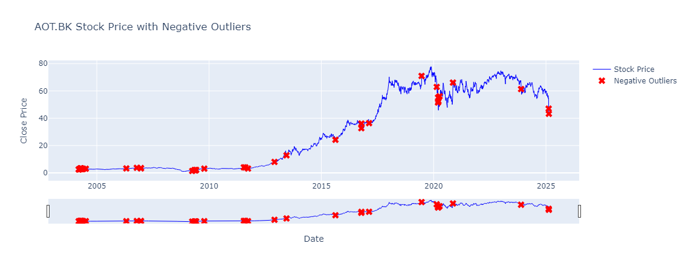

# การตรวจจับ Outlier ในข้อมูลราคาหุ้น AOT ด้วย Rolling Mean และ Standard Deviation

## คำอธิบายโปรเจกต์
โค้ดนี้ใช้สำหรับวิเคราะห์ข้อมูลราคาหุ้น AOT โดยใช้ค่าเฉลี่ยเคลื่อนที่ (Rolling Mean) และส่วนเบี่ยงเบนมาตรฐาน (Rolling Standard Deviation) เพื่อระบุจุดที่ราคาต่ำกว่าค่าเฉลี่ยอย่างมีนัยสำคัญ (Outlier ฝั่งลบ) และแสดงผลลัพธ์ในรูปแบบกราฟ Interactive ด้วย Plotly

---

## คุณสมบัติของโค้ด
- โหลดและประมวลผลข้อมูลราคาหุ้น AOT จากไฟล์ CSV
- คำนวณ **Rolling Mean** และ **Rolling Standard Deviation** เพื่อใช้เป็นตัวชี้วัดแนวโน้มราคา
- คำนวณช่วงความผันผวนตามระดับ SD: \( \pm 1SD, \pm 2SD, \pm 3SD \)
- ตรวจจับ **Outliers ฝั่งลบ** (ราคาที่ต่ำกว่าค่าเฉลี่ยมากเกินไป หรือ **ต่ำกว่าค่า -3SD**)
- แสดงผลลัพธ์เป็น **กราฟ Interactive** ที่สามารถเลื่อนดูข้อมูลย้อนหลังได้

---

## การติดตั้งและการใช้งาน
### 1. ติดตั้งไลบรารีที่จำเป็น
```bash
pip install pandas plotly
```

### 2. เตรียมข้อมูล
- ไฟล์ข้อมูลต้องเป็น CSV และมีคอลัมน์ต่อไปนี้:
  - `Date`: วันที่ของข้อมูล
  - `Open`: ราคาเปิด
  - `High`: ราคาสูงสุดของวัน
  - `Low`: ราคาต่ำสุดของวัน
  - `Close`: ราคาปิดของวัน

### 3. รันโค้ด Python
บันทึกโค้ดด้านล่างเป็นไฟล์ `.py` แล้วรันด้วย Python

```python
import pandas as pd
import plotly.graph_objects as go

# โหลดข้อมูลราคาหุ้น
data = pd.read_csv("AOT.BK.csv")  # ต้องมี 'Date', 'Open', 'High', 'Low', 'Close'
data["Date"] = pd.to_datetime(data["Date"])  # แปลงเป็น datetime

# คำนวณ Rolling Mean และ Rolling SD
window = 20  # ใช้ค่าเฉลี่ยย้อนหลัง 20 วัน
data['Rolling_Mean'] = data['Close'].rolling(window=window).mean()
data['Rolling_SD'] = data['Close'].rolling(window=window).std()

# คำนวณช่วง ±1SD, ±2SD, ±3SD
for i in range(1, 4):
    data[f'Range_Upper_{i}SD'] = data['Rolling_Mean'] + (i * data['Rolling_SD'])
    data[f'Range_Lower_{i}SD'] = data['Rolling_Mean'] - (i * data['Rolling_SD'])

# ตรวจจับ Outliers ที่ราคาต่ำกว่า -3SD
outliers_negative = data[data['Close'] < data['Range_Lower_3SD']]

# พล็อตกราฟ Interactive
fig = go.Figure()
fig.add_trace(go.Scatter(x=data['Date'], y=data['Close'], mode='lines', name='Stock Price', line=dict(color='blue', width=1)))
fig.add_trace(go.Scatter(x=outliers_negative['Date'], y=outliers_negative['Close'], mode='markers', name='Negative Outliers', marker=dict(color='red', size=10, symbol='x')))

fig.update_layout(
    title="AOT.BK Stock Price with Negative Outliers (Below -3 SD)",
    xaxis_title="Date",
    yaxis_title="Close Price",
    template="plotly",
    xaxis_rangeslider_visible=True
)

fig.show()
```

### 4. วิเคราะห์ผลลัพธ์
- จุดสีแดง (Negative Outliers) คือวันที่ราคาปรับตัวลงต่ำกว่าค่าเฉลี่ย -3SD ซึ่งเป็นเหตุการณ์ผิดปกติที่อาจเกิดจากข่าวร้าย, การเทขายหุ้นจำนวนมาก, หรือปัจจัยทางเศรษฐกิจ
- ผู้ใช้สามารถปรับ `window` และ `SD threshold` เพื่อทดลองค่าต่างๆ ให้เหมาะสมกับลักษณะของข้อมูล

---

## การปรับแต่งเพิ่มเติม
- **เปลี่ยนช่วงเวลาเฉลี่ย (Rolling Window)**: ลองปรับค่า `window` เป็น 10, 50 หรือ 100 เพื่อดูผลลัพธ์ที่แตกต่าง
- **ใช้ SD อื่นๆ ในการหาจุด Outlier**: สามารถเปลี่ยน `3SD` เป็น `2SD` หรือ `4SD` ตามลักษณะของตลาด
- **แสดง Outlier ฝั่งบวก**: ตรวจจับราคาที่สูงกว่าค่าเฉลี่ย +3SD ด้วยเงื่อนไข `data['Close'] > data['Range_Upper_3SD']`

---

<p align="center">
  
</p>


## สรุป
โค้ดนี้ใช้เทคนิค Rolling Mean และ Standard Deviation ในการตรวจจับ Outlier ฝั่งลบในข้อมูลราคาหุ้น AOT และแสดงผลเป็นกราฟแบบ Interactive เพื่อให้ง่ายต่อการวิเคราะห์แนวโน้มและความผิดปกติของราคาในอดีต 🎯


# การตรวจจับ Outliers ของราคาหุ้น AOT ด้วย Isolation Forest

## คำอธิบาย
โค้ดนี้ใช้โมเดล **Isolation Forest** เพื่อตรวจจับ **Outliers** หรือจุดข้อมูลที่ผิดปกติในราคาหุ้น **AOT.BK** โดยเฉพาะ **การลดลงของราคา** อย่างรุนแรง (Negative Outliers) ซึ่งอาจบ่งบอกถึงเหตุการณ์สำคัญที่กระทบต่อตลาด

---

## วิธีการทำงานของโค้ด

### 1. **โหลดข้อมูลราคาหุ้น**
ข้อมูลราคาหุ้นจะถูกโหลดจากไฟล์ `AOT.BK.csv` ซึ่งต้องมีคอลัมน์ต่อไปนี้:
- `Date` (วันที่)
- `Close` (ราคาปิดของหุ้นแต่ละวัน)
- `Volume` (ปริมาณการซื้อขายของหุ้นแต่ละวัน)

```python
import pandas as pd
import plotly.graph_objects as go
from sklearn.ensemble import IsolationForest

data = pd.read_csv("AOT.BK.csv")  # โหลดข้อมูล
```

---

### 2. **แปลงคอลัมน์ Date เป็น datetime**
เพื่อให้สามารถจัดการข้อมูลวันเวลาได้ง่ายขึ้น
```python
data["Date"] = pd.to_datetime(data["Date"])
```

---

### 3. **คำนวณ Daily Return**
คำนวณการเปลี่ยนแปลงของราคาปิดเป็นเปอร์เซ็นต์ (`daily_return`) เพื่อดูแนวโน้มการเปลี่ยนแปลงของหุ้น
```python
data['daily_return'] = data['Close'].pct_change()
```

ค่าของ `daily_return` จะมีลักษณะดังนี้:
- ถ้าราคาเพิ่มขึ้น ค่า `daily_return` จะเป็นบวก
- ถ้าราคาลดลง ค่า `daily_return` จะเป็นลบ

**หมายเหตุ:** ค่าตัวแรกของ `daily_return` จะเป็น `NaN` เนื่องจากไม่มีข้อมูลก่อนหน้าให้คำนวณ

---

### 4. **ลบค่าที่เป็น NaN**
```python
data.dropna(subset=['daily_return'], inplace=True)
```

เนื่องจากการใช้ `.pct_change()` ทำให้เกิดค่า `NaN` ในแถวแรก เราจึงลบออกเพื่อป้องกันปัญหาในการฝึกโมเดล

---

### 5. **ฝึกโมเดล Isolation Forest**
ใช้ **Isolation Forest** เพื่อค้นหาจุดที่ผิดปกติ โดยโมเดลจะวิเคราะห์พฤติกรรมของ `daily_return` และ `Volume`
```python
model = IsolationForest(contamination=0.01, random_state=42)
```

- `contamination=0.01` หมายความว่า เราสมมติว่า **1% ของข้อมูลเป็น Outliers**
- `random_state=42` ทำให้ผลลัพธ์คงที่เมื่อรันโค้ดหลายครั้ง

---

### 6. **ให้โมเดลคาดการณ์ Outliers**
```python
data['outlier'] = model.fit_predict(data[['daily_return', 'Volume']])
```
โมเดลจะให้ค่าผลลัพธ์เป็น **1** (ข้อมูลปกติ) หรือ **-1** (Outlier)

---

### 7. **เลือกเฉพาะ Negative Outliers**
```python
negative_outliers = data[data['outlier'] == -1]
```
เราจะเก็บเฉพาะจุดที่เป็น **Outliers ฝั่งลบ** ซึ่งหมายถึงราคาหุ้นที่ลดลงผิดปกติ

---

## ผลลัพธ์ที่ได้
โค้ดนี้จะช่วยให้เราระบุจุดที่ราคาหุ้นลดลงรุนแรง ซึ่งอาจเป็นสัญญาณของเหตุการณ์สำคัญ เช่น:
- ข่าวร้ายเกี่ยวกับบริษัท
- ปัจจัยทางเศรษฐกิจหรือการเมืองที่ส่งผลกระทบ
- การเทขายจำนวนมากจากนักลงทุนรายใหญ่ (Panic Sell)

ข้อมูลที่ได้สามารถนำไปใช้วิเคราะห์เพิ่มเติม เช่น:
- วางแผนกลยุทธ์การซื้อขายหุ้น
- หาสาเหตุของเหตุการณ์ที่เกิดขึ้นในอดีต
- ใช้ร่วมกับ Indicator อื่นๆ เพื่อการตัดสินใจที่แม่นยำขึ้น

---


---

## การปรับแต่งเพิ่มเติม
- เปลี่ยนค่า `contamination` (เช่น 0.05 หรือ 0.1) เพื่อให้โมเดลจับ Outliers ได้มากขึ้นหรือน้อยลง
- เพิ่ม Features อื่นๆ เช่น `Open`, `High`, `Low` เพื่อให้โมเดลเรียนรู้จากข้อมูลที่หลากหลายขึ้น
- นำผลลัพธ์ไปวิเคราะห์เพิ่มเติมโดยใช้กราฟ Plotly หรือ Matplotlib

---

## ข้อจำกัดของโมเดล
- Isolation Forest ไม่สามารถระบุสาเหตุของ Outliers ได้ ต้องวิเคราะห์เพิ่มเติมจากข้อมูลอื่นๆ
- ค่า `contamination` ต้องถูกปรับให้เหมาะสมกับข้อมูลที่ใช้
- ผลลัพธ์อาจแตกต่างไปตามขนาดของข้อมูลและพฤติกรรมของตลาดหุ้น

---

<p align="center">
  
</p>

## ข้อสรุป
โค้ดนี้ช่วยให้เราสามารถตรวจจับ **ราคาหุ้นที่ลดลงผิดปกติ** ได้โดยอัตโนมัติ ซึ่งเป็นประโยชน์สำหรับนักลงทุนที่ต้องการเฝ้าระวังเหตุการณ์สำคัญในตลาดและวิเคราะห์แนวโน้มของหุ้น AOT ได้อย่างแม่นยำมากขึ้น 📉📊


